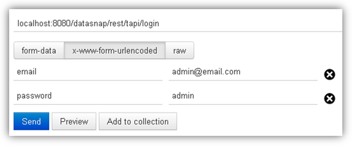
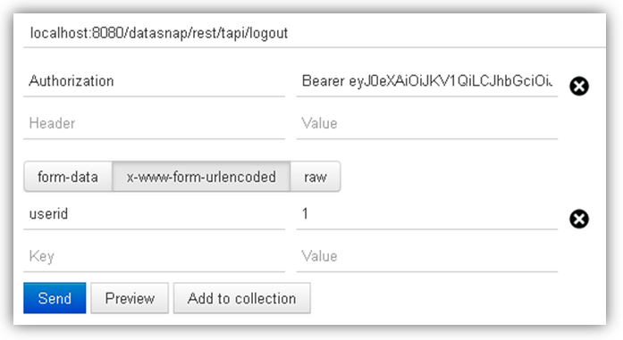

# DataSnap REST (Delphi)

Nesse projeto temos uma aplicação simples do DataSnap com REST usando os métodos GET, POST e DELETE. Também foi utilizado a autenticação com JWT.

Uso de:
* Delphi e MySQL.
* Delphi JOSE and JWT Library: [JOSE](https://github.com/paolo-rossi/delphi-jose-jwt).

O Delphi utilizado foi o tokyo 10.2.1 e para o MySQL utilizei o XAMPP (MariaDB - 10.1.26) na versão 7.1.9 para Windows.

### Banco de Dados (BD)

Você pode criar o BD assim: `CREATE DATABASE nomeDoBanco;`.

Foram criadas duas tabelas no banco de dados:

```
CREATE TABLE `users` (
  `ID` int(11) NOT NULL,
  `NAME` varchar(100) COLLATE utf8mb4_unicode_ci NOT NULL,
  `PASS` varchar(100) COLLATE utf8mb4_unicode_ci NOT NULL,
  `EMAIL` varchar(100) COLLATE utf8mb4_unicode_ci NOT NULL,
  `CPF_CNPJ` varchar(100) COLLATE utf8mb4_unicode_ci NOT NULL,
  `RG_IE` varchar(50) COLLATE utf8mb4_unicode_ci DEFAULT NULL,
  `PHONE1` varchar(100) COLLATE utf8mb4_unicode_ci DEFAULT NULL,
  `PHONE2` varchar(100) COLLATE utf8mb4_unicode_ci DEFAULT NULL,
  `ADDRESS` varchar(250) COLLATE utf8mb4_unicode_ci DEFAULT NULL,
  `NUMBER` int(11) DEFAULT NULL,
  `NEIGHBORHOOD` varchar(250) COLLATE utf8mb4_unicode_ci DEFAULT NULL,
  `CITY` varchar(250) COLLATE utf8mb4_unicode_ci DEFAULT NULL,
  `STATE` varchar(150) COLLATE utf8mb4_unicode_ci DEFAULT NULL,
  `COUNTRY` varchar(150) COLLATE utf8mb4_unicode_ci DEFAULT NULL,
  `CEP` varchar(100) COLLATE utf8mb4_unicode_ci DEFAULT NULL
) ENGINE=InnoDB DEFAULT CHARSET=utf8mb4 COLLATE=utf8mb4_unicode_ci;
```

```
CREATE TABLE `wishlist` (
  `ID` int(11) NOT NULL,
  `USER_ID` int(11) NOT NULL,
  `PRODUCT_ID` int(11) NOT NULL
) ENGINE=InnoDB DEFAULT CHARSET=utf8mb4 COLLATE=utf8mb4_unicode_ci;
```


## Como utilizar

Deve-se configurar a conexão com o BD no componente TSQLConnection na propriedade Driver, em ServerMethodsUnit1.pas.

Para o teste da API foi utilizado o [Postman](https://www.getpostman.com/), mas você pode utilizar outra ferramenta de sua preferência.

A URL principal é: localhost:8080/datasnap/rest/tapi


`**GET**` /user/{id}

URL que retorna os dados do usuário de acordo com o id do mesmo passado por parâmetro.
Tem que ser passado no Header da requisição o token, com a chave "*Authorization*" e o valor "*Bearer {token}*". Esse token é gerado quando o usuário faz o login.

Exemplo: localhost:8080/datasnap/rest/tapi/user/1

`**GET**` /getaddress/{CEP}

Retorna o endereço solicitado por meio do CEP passado na URL. Foi utilizada a API [ViaCEp](https://viacep.com.br/).

Exemplo: localhost:8080/datasnap/rest/tapi/getaddress/58400123


`**POST**` /login

URL para autenticar o cliente, passando e-mail e senha no corpo da requisição.

Exemplo: localhost:8080/datasnap/rest/tapi/login



`**POST**` /logout

URL para fazer o logout (sair da aplicação), passando o id do usuário no corpo da requisição.

Exemplo: localhost:8080/datasnap/rest/tapi/logout




`**DELETE**` /remove_wishlist?userid={id_do_usuário}&itemid={id_do_item}

Este método envia para o servidor uma solicitação para remover um determinado item da lista de desejos de um determinado usuário.
Também tem que ser passado no Header da requisição o token.

Exemplo: localhost:8080/datasnap/rest/tapi/remove_wishlist?userid=1&itemid=3


## Licença

[](https://creativecommons.org/licenses/by-nc-sa/4.0/)

MIT License

Copyright (c) 2018 [Harllan Andryê](https://github.com/HarllanAndrye)

